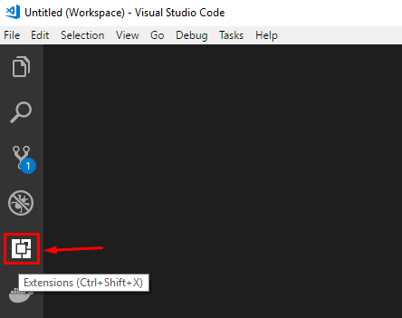
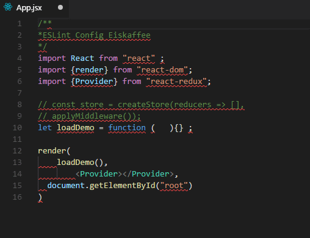

<p align="center">
  
</p>

# Como estruturar e organizar seu projeto [🇺🇸](README.md)

Apenas um simples exemplo de como iniciar seu projeto de front-end seguindo as boas práticas de organização e padronização.


## Pré requisitos

- Instalação do [Node](https://nodejs.org/en/) versão 8 ou superior
- Instalação do [Git](https://git-scm.com/downloads)
- Ter um editor de código de preferência o [Vscode](https://code.visualstudio.com/download)


## Sumário

[VSCODE Instalando os plugins](#vscode-instalando-os-plugins)

- Sublime Text Keymap
- JavaScript (ES6) code snippet
- Vscode Icons
- Sass
- Editorconfig
- ESLint
- Settings Sync


[GIT Iniciando o repositório](#git-iniciando-o-reposit%C3%B3rio)

- [Setando as configurações de usuário](#)
- [Como iniciar o repositório localmente](#)
- [Como adicionar o repositório remoto mesmo já tendo criado localmente](#)
- [Quais principais comandos do GIT usar](#)
- [GITIGNORE remova arquivos que não devem ser versionados](#)


[NPM Instalando as dependencias](#npm-instalando-as-dependencias)

- [Gerando o package.json automaticamente](#)
- [Instalando os pacotes](#)
- [Diferença de instalar como dependencia e dependencia de desenvolvimento](#)
- [Comandos NPM para facilitar](#)
- [Instalando o YARN via NPM](#)


[GULP Como iniciar](#gulp-como-iniciar)

- [Fazendo a instalação](#)
- [Porque você Não deveria instalar o GULP globalmente](#)
- [Criando as primeiras tasks com o GULP](#)


[ESLINT Padronizando o JavaScript](#eslint-padronizando-o-javascript)

- [Instalando o ESLINT](#)
- [Criando arquivo inicial](#)
- [Integração com o VSCODE](#)
- [Adicionando suas regras](#)


## VSCODE Instalando os plugins

Extensões recomendadas para usar no **VSCODE**



### Plugins que não necessitam de configuração
- Sublime Text Keymap
- JavaScript (ES6) code snippet
- Vscode Icons
- Sass

## Editorconfig 

- Faça o download da extensão do Editorconfig [[aqui](https://marketplace.visualstudio.com/items?itemName=EditorConfig.EditorConfig)]
- Crie um arquivo `.editorconfig` na raiz do seu projeto.

```properties
root = true

[*]
indent_size = 4
indent_style = space
end_of_line = lf
trim_trailing_whitespace = true
charset = utf-8
insert_final_newline = true
```

## ESLint 

- Faça o download da extensão do ESLint [[aqui](https://marketplace.visualstudio.com/items?itemName=dbaeumer.vscode-eslint)]
- Passe uma **configuração** no seu VSCode e depois adicione o ESLint como depencência de desenvolvimento do seu projeto [[veja aqui](#eslint-padronizando-o-javascript)].


**Aplica algumas correções automaticamente ao salvar um arquivo**

Adicione essa linha no seu `User Settings` do VSCode - atalho [CTRL + ,] ou [CMD + ,]

```json
"eslint.autoFixOnSave": true
```




## Settings Sync


## GIT Iniciando o repositório
## NPM Instalando as dependencias
## GULP Como iniciar
## ESLINT Padronizando o JavaScript


#### [< Voltar para página principal](README.md) [🇺🇸](README.md)
