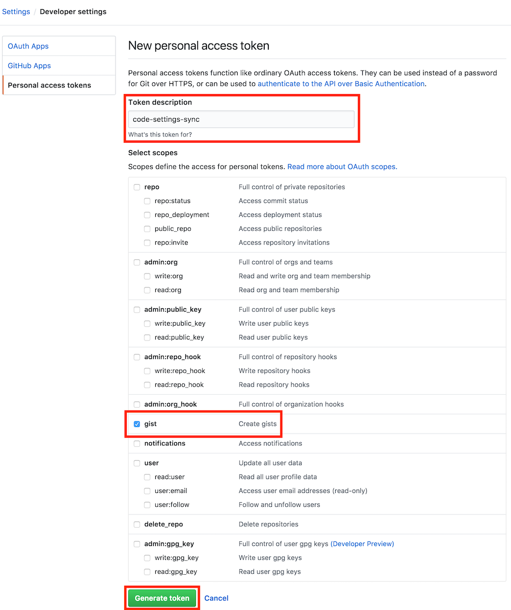
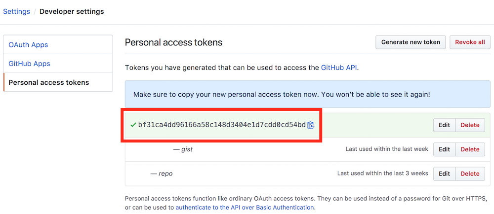
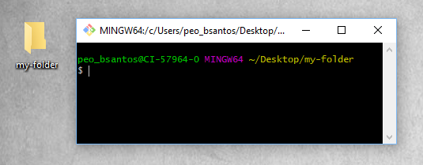
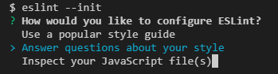

<p align="center">
  
</p>

# Como estruturar e organizar seu projeto [🇺🇸](README-en.md)

Apenas um simples exemplo de como iniciar seu projeto de front-end seguindo as boas práticas de organização e padronização.


## Pré requisitos

- Instalação do [Node](https://nodejs.org/en/) versão 8 ou superior
- Instalação do [Git](https://git-scm.com/downloads)
- Ter um editor de código de preferência o [VSCode](https://code.visualstudio.com/download)


## Sumário

[VSCode Instalando os plugins](#vscode-instalando-os-plugins)

- Sublime Text Keymap
- JavaScript (ES6) code snippet
- VSCode Icons
- Sass
- [Editorconfig](#editorconfig)
- [ESLint](#eslint)
- [Settings Sync](#settings-sync)


[GIT Iniciando o repositório](#git-iniciando-o-reposit%C3%B3rio)

- [Setando as configurações de usuário](#setando-as-configura%C3%A7%C3%B5es-de-usu%C3%A1rio)
- [Como iniciar o repositório localmente](#como-iniciar-o-reposit%C3%B3rio-localmente)
- [GITIGNORE remova arquivos que não devem ser versionados](#gitignore-remova-arquivos-que-n%C3%A3o-devem-ser-versionados)
- [Como adicionar o repositório remoto mesmo já tendo criado localmente](#)
- [Quais principais comandos do GIT usar](#)


[NPM Instalando as dependencias](#npm-instalando-as-dependencias)

- [Gerando o package.json automaticamente](#)
- [Instalando os pacotes](#)
- [Diferença de instalar como dependencia e dependencia de desenvolvimento](#)
- [Comandos NPM para facilitar](#)
- [Instalando o YARN via NPM](#)


[GULP Como iniciar](#gulp-como-iniciar)

- [Fazendo a instalação](#)
- [Porque você Não deveria instalar o GULP globalmente](#)
- [Criando as primeiras tasks com o GULP](#)


[ESLINT Padronizando o JavaScript](#eslint-padronizando-o-javascript)

- [Instalando o ESLINT](#)
- [Criando arquivo inicial](#)
- [Integração com o VSCode](#)
- [Adicionando suas regras](#)


## VSCode Instalando os plugins

Extensões recomendadas para usar no **VSCode**


### Plugins que não necessitam de configuração
- Sublime Text Keymap
- JavaScript (ES6) code snippet
- VSCode Icons
- Sass

## Editorconfig

- Página da extensão do Editorconfig disponível [[aqui](https://marketplace.visualstudio.com/items?itemName=EditorConfig.EditorConfig)]
- Crie um arquivo `.editorconfig` na raiz do seu projeto.

```properties
root = true

[*]
indent_size = 4
indent_style = space
end_of_line = lf
trim_trailing_whitespace = true
charset = utf-8
insert_final_newline = true
```

## ESLint

### Para que server?
O **ESLint** é um validador de padrões para JavaScript, você pode configurar o seu padrão para que outros desenvolvedores possam seguir. Nessa extensão para **VSCode**, identifica a configuração passada no projeto e ao salvar aplica algumas correções **automaticamente**.

- Página da extensão do ESLint disponível [[aqui](https://marketplace.visualstudio.com/items?itemName=dbaeumer.vscode-eslint)]
- Passe uma **configuração** no seu VSCode e depois adicione o ESLint como depencência de desenvolvimento do seu projeto [[veja aqui](#eslint-padronizando-o-javascript)].


Adicione essa linha no seu `User Settings` do VSCode - atalho [CTRL + ,] ou [CMD + ,]

```json
"eslint.autoFixOnSave": true
```


## Settings Sync

### Para que server?
Com o **Settings Sync** você pode sincronizar suas configurações do **VSCode**, como tamanho de font, terminal preferido, extensões em qualquer computador que você usar.

- Página da extensão do Settings Sync disponível [[aqui](https://marketplace.visualstudio.com/items?itemName=Shan.code-settings-sync)]

- Após instalar irá pedir um token, gere esse token no seu GitHub, salve esse token, pois será usado para sincronizar em outros computadores que você for usar

Vá em: [Settings](https://github.com/settings) / [Developer settings](https://github.com/settings/tokens) / [Personal access tokens](https://github.com/settings/tokens) / **Generate New Token**

- Passo 1


- Passo 2


- Passo 3


> Salve o **token** em algum lugar para ser usado futuramente em outros computadores.


## GIT Iniciando o repositório

### Setando as configurações de usuário

Ao passar as configurções você estará informando qual email e nome de usuário está versionando os arquivos em questão.

#### Setando nome de usuário para qualquer repositório no seu computador:

**1.** Passando o `username`

```bash
git config --global user.name "Seu nome"
```

**2.** Verificando o nome adicionado globalmente

```bash
git config --global user.name
```

Resultado: **Seu nome**


---


#### Setando e-mail para qualquer repositório no seu computador:

**1.** Passando o e-mail

```bash
git config --global user.email "seu-email@site.com.br"
```

**2.** Verificando o e-mail adicionado globalmente

```bash
git config --global user.email
```

Resultado: **seu-email@site.com.br**


---


### Como iniciar o repositório localmente

Mesmo que você ainda não tenha um repositório remoto criado, você pode e deve versionar seus arquivos localmente, assim mantem um histórico de tudo já feito em seu projeto. E depois você pode conecta-ló à um repositório remoto com facilidade.

**1.** Escolha uma pasta/diretório

**2.** Abra o bash a partir dessa pasta/diretório



**3.** No terminado digite, lembrando você tem que ter o **GIT** instalado, se você ainda não instalou, [clique aqui](https://git-scm.com/downloads):

```bash
git init
```

---


### GITIGNORE remova arquivos que não devem ser versionados

Remove arquivos desnecessários para o versionamento.

As vezes você precisa ou quer remover algum arquivo que não precisa ter um histórico de versões, para fazer isso é bem simples. Crie um arquivo na raiz do seu projeto chamado `.gitignore` com o ponto no começo mesmo.

#### Jeito rápido de criar o arquivo, se já estiver com o terminal aberto!

```bash
touch .gitignore
```

Após criar o arquivo, adicione nele os nomes dos arquivos e pastas que não serão versionados. A leitura do arquivo é feita linha a linha, então inclua apenas um nome por linha.

**Exemplo:**

```
node_modules/
jspm_packages/
*.zip
*.lock
.cache
```

Vimos a forma manual, mas agora tem uma forma mais legal de fazer isso usando um pacote do **NPM**, assim você consegue ter uma lista mais completa de arquivos para não serem versionados.

**1.** Instale o pacote globalmente, você pode ver o [aqui](https://www.npmjs.com/package/gitignore).

```bash
npm install gitignore -g
```

**2.** Após instalar esse pacote, vá no terminal onde está a pasta do seu projeto e digite o comando abaixo para consultar os tipos disponíveis:

```bash
gitignore -types
```

**3.** Criar arquivo `.gitignore` e já adiona quais arquivos de projetos do tipo **node** não serão versionados.

```bash
gitignore node
```


## NPM Instalando as dependencias
## GULP Como iniciar

## ESLINT Padronizando o JavaScript

### Instalando o ESLINT

Use o comando abaixo para instalar em seu projeto e faça a instalação **global**.

```bash
npm install -D eslint
```

```bash
npm install -g eslint
```

### Criando arquivo inicial

Para iniciar o eslint, instale globalmente como indicado acima, e inicie com o comando abaixo e siga os passos indicados no terminal.



```bash
eslint --init
```


#### [< Voltar para página principal](README.md) [🇺🇸](README.md)
